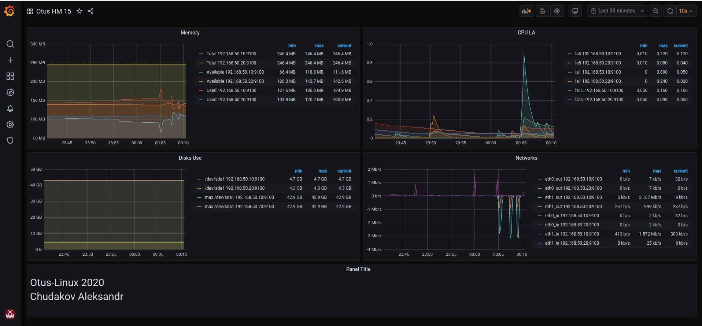

# Мониторинг

## Домашняя работа

```txt
Настройка мониторинга
Настроить дашборд с 4-мя графиками
1) память
2) процессор
3) диск
4) сеть

настроить на одной из систем
- zabbix (использовать screen (комплексный экран))
- prometheus - grafana

* использование систем примеры которых не рассматривались на занятии
- список возможных систем был приведен в презентации

в качестве результата прислать скриншот экрана - дашборд должен содержать в названии имя приславшего
Критерии оценки: 5 - основное задание
6 - задание со зведочкой
```

## Описание

### Установка ansible

```bash
cd HW_15
python3 -m venv venv
source venv/bin/activate
pip install --upgrade pip
pip inatall -r requirements.txt
ansible-galaxy install -r requirements.yml -f
```

### Запуск Стенда

```bash
vagrant up
ansible -i inventory/vagrant.yml -m ping all
ansible-playbook -i inventory/vagrant.yml  playbooks/install_monitoring.yml
```

### Описание работы

* После запуска двух виртуальных машин и установки окружения с помощью Ansible. Будут доступный следующие ресурсы

1. [Grafana](http://192.168.50.10:3000/) (Логин: ```otus``` Пароль: ```otus2020```)
1. [Prometheus](http://192.168.50.10:9090/)

* В Grafana автоматически создается дашборд
* 

* Плейбук устанавливает и настраивает с помощью ролей: Node_exporter, Grafana,  Prometheus
