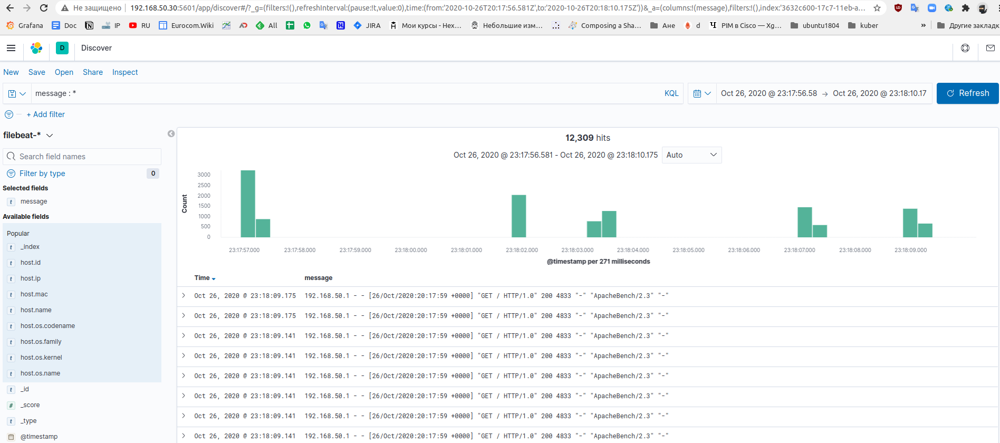

# Настраиваем центральный сервер для сбора логов

## Домашнее задание

```txt
Настраиваем центральный сервер для сбора логов
в вагранте поднимаем 2 машины web и log
на web поднимаем nginx
на log настраиваем центральный лог сервер на любой системе на выбор
- journald
- rsyslog
- elk
настраиваем аудит следящий за изменением конфигов нжинкса

все критичные логи с web должны собираться и локально и удаленно
все логи с nginx должны уходить на удаленный сервер (локально только критичные)
логи аудита должны также уходить на удаленную систему


* развернуть еще машину elk
и таким образом настроить 2 центральных лог системы elk И какую либо еще
в elk должны уходить только логи нжинкса
во вторую систему все остальное
Критерии оценки: 4 - если присылают только логи скриншоты без вагранта
5 - за полную настройку
6 - если выполнено задание со звездочкой
```

## Описание

### Запуск Стенда

```bash
cd HW_16
python3.8 -m venv venv
source venv/bin/activate
pip install --upgrade pip
pip install -r requirements.txt

vagrant up
ansible -i inventory/vagrant.yml -m ping all
ansible-playbook -i inventory/vagrant.yml playbooks/install_logging.yml
```

### Описание стенда

* 3 виртуальных машины , объем памяти 4.5GB
* Rsyslog сервер собирает все логи со всех хостов

```bash
[vagrant@syslog ~]$ sudo tree /var/log/rsyslog/
/var/log/rsyslog/
|-- 127.0.0.1
|   `-- 2020-10-26
|       |-- filebeat.log
|       |-- rsyslogd.log
|       |-- sshd.log
|       |-- sudo.log
|       |-- systemd-logind.log
|       `-- systemd.log
|-- 192.168.50.10
|   `-- 2020-10-26
|       |-- filebeat.log
|       |-- nginx.log
|       |-- rsyslogd.log
|       |-- sshd.log
|       |-- sudo.log
|       |-- systemd-logind.log
|       `-- systemd.log
`-- 192.168.50.30
    `-- 2020-10-26
        |-- anacron.log
        |-- ansible-ansible.legacy.copy.log
        |-- ansible-ansible.legacy.file.log
        |-- ansible-ansible.legacy.slurp.log
        |-- ansible-ansible.legacy.stat.log
        |-- ansible-ansible.legacy.yum.log
        |-- ansible-systemd.log
        |-- filebeat.log
        |-- groupadd.log
        |-- kibana.log
        |-- logstash.log
        |-- rsyslogd.log
        |-- run-parts(.log
        |-- sshd.log
        |-- sudo.log
        |-- systemd-logind.log
        |-- systemd-udevd.log
        |-- systemd.log
        |-- useradd.log
        `-- yum.log

6 directories, 33 files
```

* elk стек собирает только логи nginx с помошью filebeat и модуля nginx
* logstash настроен на флиьтрацию всего кроме данных filebeat из модуля nginx


### Адреса

* Nginx [http://192.168.50.10/](http://192.168.50.10/)
* Kibana [http://192.168.50.30:5601/](http://192.168.50.30:5601/)
