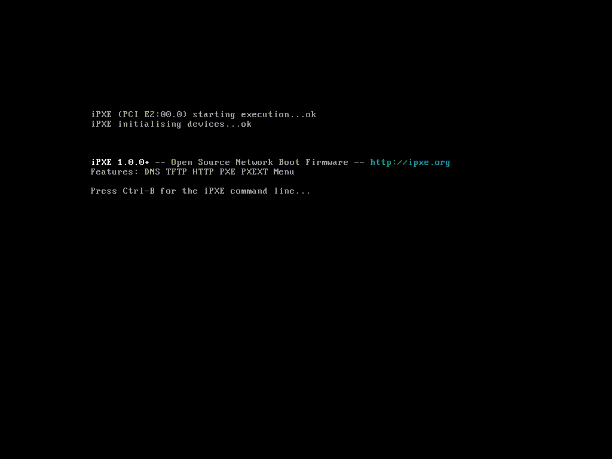
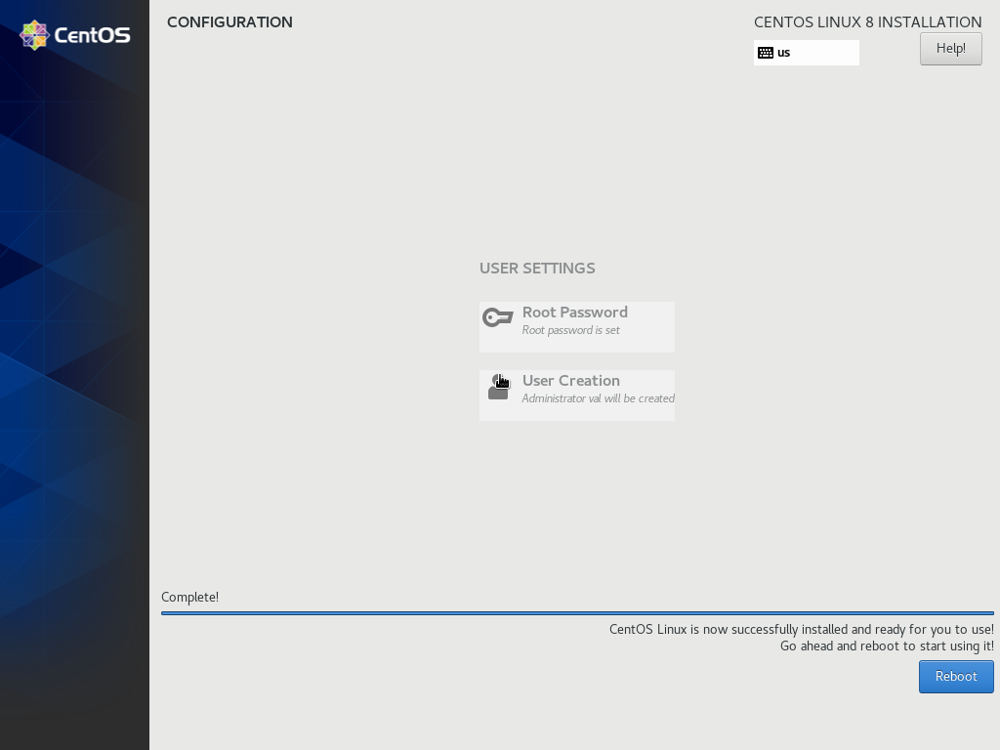

# DHCP, PXE

## Домашнее задание

```txt
Настройка PXE сервера для автоматической установки
Цель: Отрабатываем навыки установки и настройки DHCP, TFTP, PXE загрузчика и автоматической загрузки
1. Следуя шагам из документа https://docs.centos.org/en-US/8-docs/advanced-install/assembly_preparing-for-a-network-install установить и настроить загрузку по сети для дистрибутива CentOS8
В качестве шаблона воспользуйтесь репозиторием https://github.com/nixuser/virtlab/tree/main/centos_pxe
2. Поменять установку из репозитория NFS на установку из репозитория HTTP
3. Настройить автоматическую установку для созданного kickstart файла (*) Файл загружается по HTTP
* 4. автоматизировать процесс установки Cobbler cледуя шагам из документа https://cobbler.github.io/quickstart/

Критерии оценки: 1. ссылка на репозиторий github.
2. Vagrantfile с шагами установки необходимых компонентов
3. Исходный код scripts для настройки сервера (если необходимо)
4. Если какие-то шаги невозможно или сложно автоматизировать, то инструкции по ручным шагам для настройки
```

## установка ansible

```bash
cd HW_19
python3 -m venv venv
source venv/bin/activate
pip install --upgrade pip
pip install -r requirements.txt
```

## запуск PSE сервера

```bash
make up
```

***Провижининг долгий. Скачивается порядка 2.5ГБ образов из интернета.***

## запуск PSE клиента

```bash
make up-client
```

Затем открываем клиент VirtualBox, нажимаем просмотр в запущенной виртуалке клиента и наблюдаем автоматическую установку, пример ниже.



