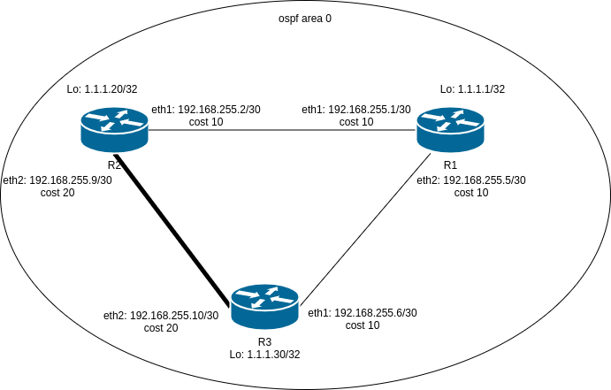

# OSPF

## Домашнее задание

```txt
- Поднять три виртуалки
- Объединить их разными vlan
1. Поднять OSPF между машинами на базе Quagga
2. Изобразить ассиметричный роутинг
3. Сделать один из линков "дорогим", но что бы при этом роутинг был симметричным

Формат сдачи:
Vagrantfile + ansible
```

## Описание

### установка Ansible

* **Используется ansible 1.10.2**

```bash
cd HW_21
python3 -m venv venv
source venv/bin/activate
pip install --upgrade pip
pip install -r requirements.txt
```

### Запуск виртуальных машин и настройка окружения

```bash
make install
```

### Схема проекта



### Сделать один из линков "дорогим", но что бы при этом роутинг был симметричным

* Сразу после запуска, стенд будет удовлетворять этой задаче
* проверить можно с помощью:

    ```bash
    make test
    ```

``` txt
## R2
default via 10.0.2.2 dev eth0 proto dhcp metric 100
1.1.1.1 via 192.168.255.1 dev eth1 proto 188 metric 20
1.1.1.30 via 192.168.255.1 dev eth1 proto 188 metric 20
10.0.2.0/24 dev eth0 proto kernel scope link src 10.0.2.15 metric 100
192.168.255.0/30 dev eth1 proto kernel scope link src 192.168.255.2 metric 101
192.168.255.4/30 via 192.168.255.1 dev eth1 proto 188 metric 20
192.168.255.8/30 dev eth2 proto kernel scope link src 192.168.255.9 metric 102

Start: Sat Nov 28 12:23:59 2020
HOST: r2                          Loss%   Snt   Last   Avg  Best  Wrst StDev
  1.|-- 192.168.255.1              0.0%     1    0.5   0.5   0.5   0.5   0.0
  2.|-- 1.1.1.30                   0.0%     1    1.3   1.3   1.3   1.3   0.0
Connection to 127.0.0.1 closed.


##R3
default via 10.0.2.2 dev eth0 proto dhcp metric 100
1.1.1.1 via 192.168.255.5 dev eth1 proto 188 metric 20
1.1.1.20 via 192.168.255.5 dev eth1 proto 188 metric 20
10.0.2.0/24 dev eth0 proto kernel scope link src 10.0.2.15 metric 100
192.168.255.0/30 via 192.168.255.5 dev eth1 proto 188 metric 20
192.168.255.4/30 dev eth1 proto kernel scope link src 192.168.255.6 metric 101
192.168.255.8/30 dev eth2 proto kernel scope link src 192.168.255.10 metric 102


Start: Sat Nov 28 12:24:12 2020
HOST: r3                          Loss%   Snt   Last   Avg  Best  Wrst StDev
  1.|-- 192.168.255.5              0.0%     1    1.1   1.1   1.1   1.1   0.0
  2.|-- 1.1.1.20                   0.0%     1    2.0   2.0   2.0   2.0   0.0
Connection to 127.0.0.1 closed.
```

### Изобразить ассиметричный роутинг

* чтобы сделать асиметричный роутинг надо убрать cost с 1 из интрефейсов дорогого линка

```bash
vagrant ssh r3
sudo vtysh
configure terminal
interface eth2
ip ospf cost 10
```

* проверка ```make test``` из репозитория

```bash
############## RUN TEST  SYNC TRACE
## R2
default via 10.0.2.2 dev eth0 proto dhcp metric 100
1.1.1.1 via 192.168.255.1 dev eth1 proto 188 metric 20
1.1.1.30 via 192.168.255.1 dev eth1 proto 188 metric 20
10.0.2.0/24 dev eth0 proto kernel scope link src 10.0.2.15 metric 100
192.168.255.0/30 dev eth1 proto kernel scope link src 192.168.255.2 metric 101
192.168.255.4/30 via 192.168.255.1 dev eth1 proto 188 metric 20
192.168.255.8/30 dev eth2 proto kernel scope link src 192.168.255.9 metric 102
Connection to 127.0.0.1 closed.
Start: Sat Nov 28 12:36:46 2020
HOST: r2                          Loss%   Snt   Last   Avg  Best  Wrst StDev
  1.|-- 192.168.255.1              0.0%     1    1.2   1.2   1.2   1.2   0.0
  2.|-- 1.1.1.30                   0.0%     1    1.8   1.8   1.8   1.8   0.0
Connection to 127.0.0.1 closed.
##R3
default via 10.0.2.2 dev eth0 proto dhcp metric 100
1.1.1.1 via 192.168.255.5 dev eth1 proto 188 metric 20
1.1.1.20 via 192.168.255.9 dev eth2 proto 188 metric 20
10.0.2.0/24 dev eth0 proto kernel scope link src 10.0.2.15 metric 100
192.168.255.0/30 proto 188 metric 20
        nexthop via 192.168.255.5 dev eth1 weight 1
        nexthop via 192.168.255.9 dev eth2 weight 1
192.168.255.4/30 dev eth1 proto kernel scope link src 192.168.255.6 metric 101
192.168.255.8/30 dev eth2 proto kernel scope link src 192.168.255.10 metric 102
Connection to 127.0.0.1 closed.
Start: Sat Nov 28 12:36:58 2020
HOST: r3                          Loss%   Snt   Last   Avg  Best  Wrst StDev
  1.|-- 1.1.1.20                   0.0%     1    1.2   1.2   1.2   1.2   0.0
```
