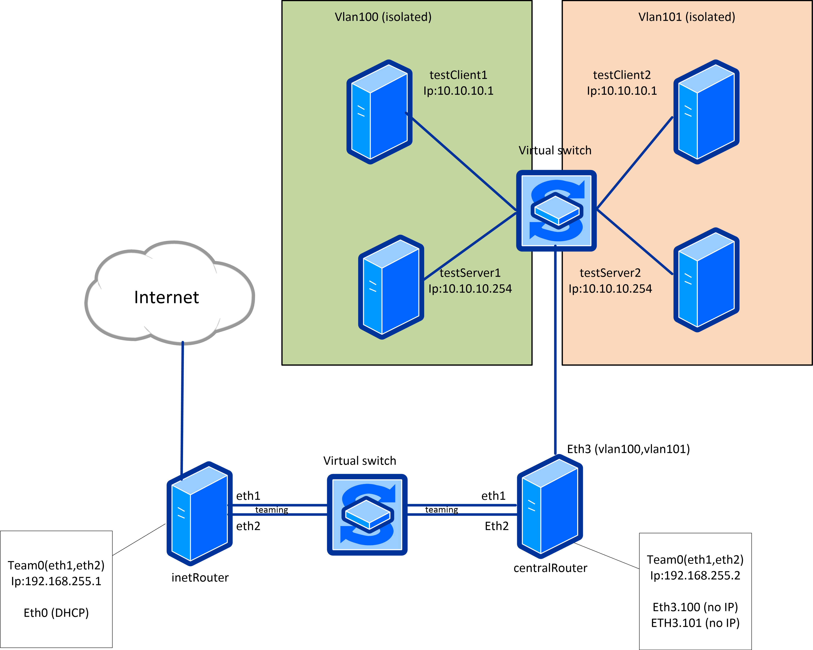

# Vlan and LASP

## Домашнее Задание

```txt
Строим бонды и вланы
в Office1 в тестовой подсети появляется сервера с доп интерфесами и адресами
в internal сети testLAN
- testClient1 - 10.10.10.254
- testClient2 - 10.10.10.254
- testServer1- 10.10.10.1
- testServer2- 10.10.10.1

развести вланами
testClient1 <-> testServer1
testClient2 <-> testServer2

между centralRouter и inetRouter
"пробросить" 2 линка (общая inernal сеть) и объединить их в бонд
проверить работу c отключением интерфейсов

для сдачи - вагрант файл с требуемой конфигурацией
Разворачиваться конфигурация должна через ансибл
```



## Описание работы

### установка ansible

```bash
cd HW_24
python3 -m venv venv
source venv/bin/activate
pip install --upgrade pip
pip install -r requirements.txt
```

### Запуск стенда

```bash
make up
```

### Запуск тестов

```bash
make test
```

Идет проверка:

* Пинги изолированных vlan
* Пинги интерфейсов с tiaming
* Пинг после отключения интерфейсов с tiaming
