# Загрузка системы

## Домашнее задание

1. Попасть в систему без пароля несколькими способами
2. Установить систему с LVM, после чего переименовать VG
3. Добавить модуль в initrd

___Операции происходят на установке Centos8 minimal___

### 1. Попасть в систему без пароля несколькими способами


#### Способ 1. init=/bin/sh

* При загрузке в Grub, выбираем нужное ядро, нажимаем **e**
* в конце строки начинающейся на linux вбиваем ```init=/bin/sh``` и нажимаем **ctr+x** для загрузки

* после загрузки сразу получаем shell
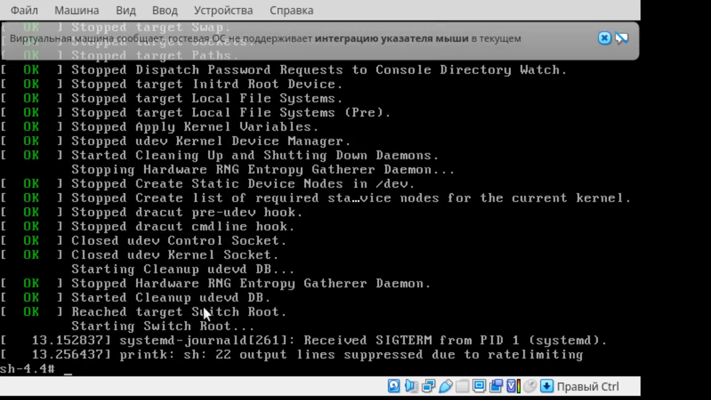
* Перемонтируем ФС в RW режим и пробуем что то записать на диск

    ```bash
    mount -o remount,rw /
    mount | grep root
    ```

    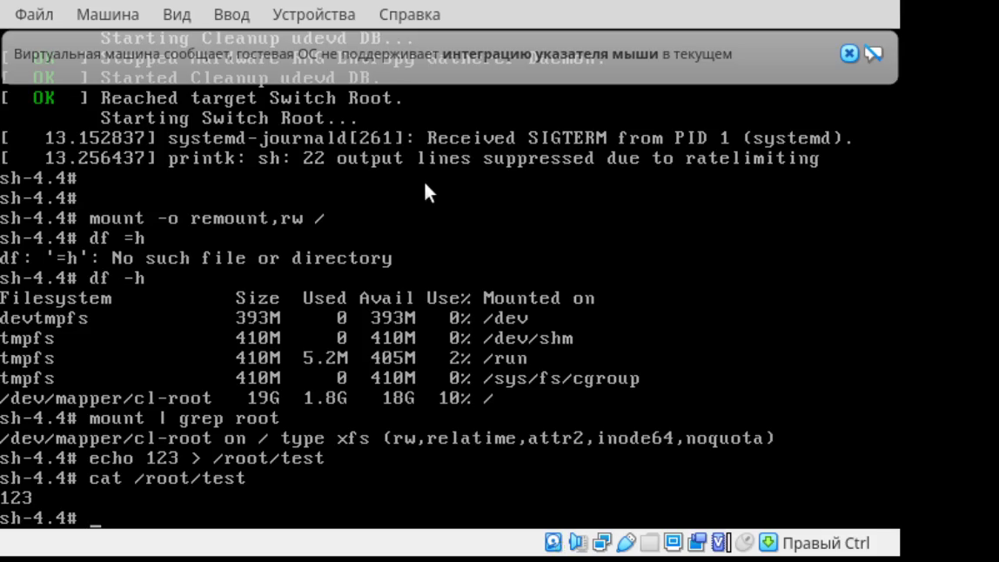

#### Способ 2. rd.break

* При загрузке в Grub, выбираем нужное ядро, нажимаем **e**
* в конце строки начинающейся на linux вбиваем ```rd.break``` и нажимаем **ctr+x** для загрузки
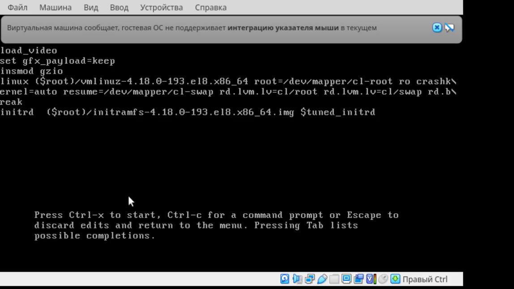
* Получаем shell
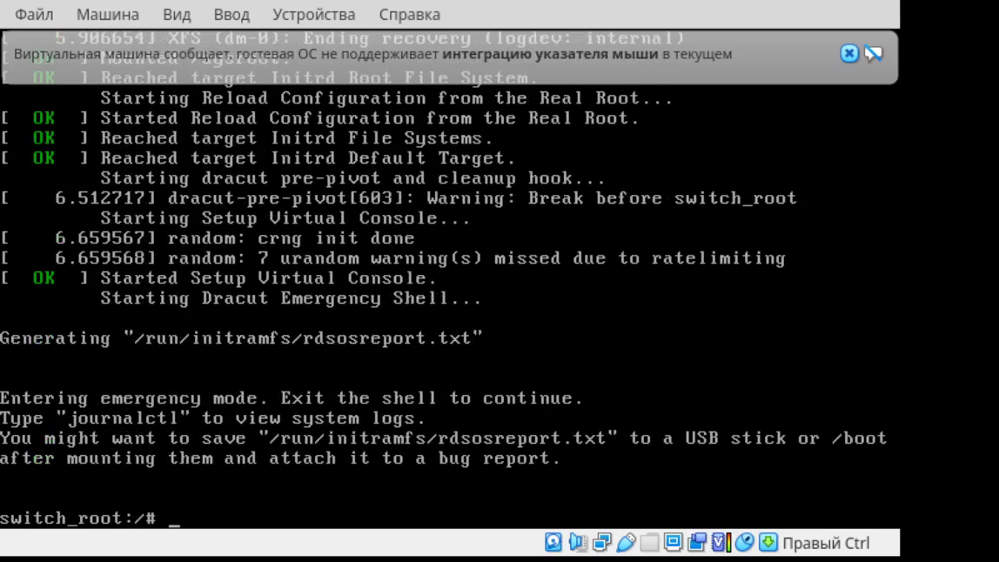
* выполняем комманды:
  * монтируем в RW режим ситсему: ```mount -o remount,rw /sysroot```
  * Делаем chroot: ```chroot /sysroot```
  * Меняем пароль root: ```passwd root```
  * запуск autorelabeling при загрузке: ```touch /.autorelabel```
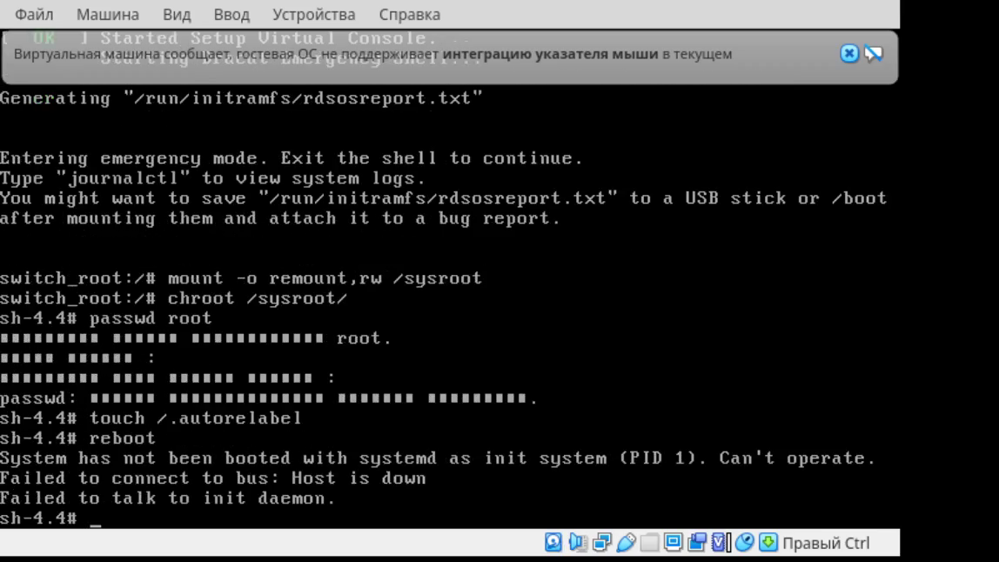
* Перезагружаемся, дожидаемся завершения autorelabeling
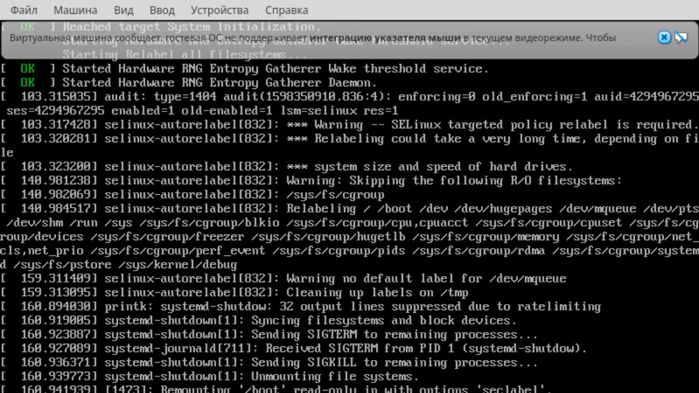
* входим под новым паролем root.

#### Способ 3. rw init=/sysroot/bin/sh

* При загрузке в Grub, выбираем нужное ядро, нажимаем **e**
* в конце строки начинающейся на linux вбиваем вместо ```ro``` ``` rw init=/sysroot/bin/sh``` и нажимаем **ctr+x** для загрузки
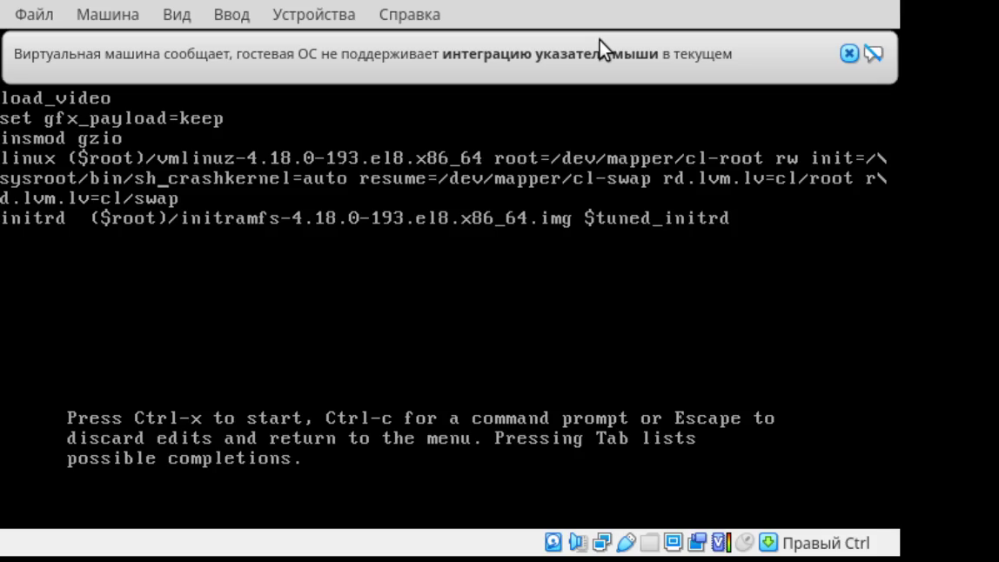
* После загрузки получаем shell
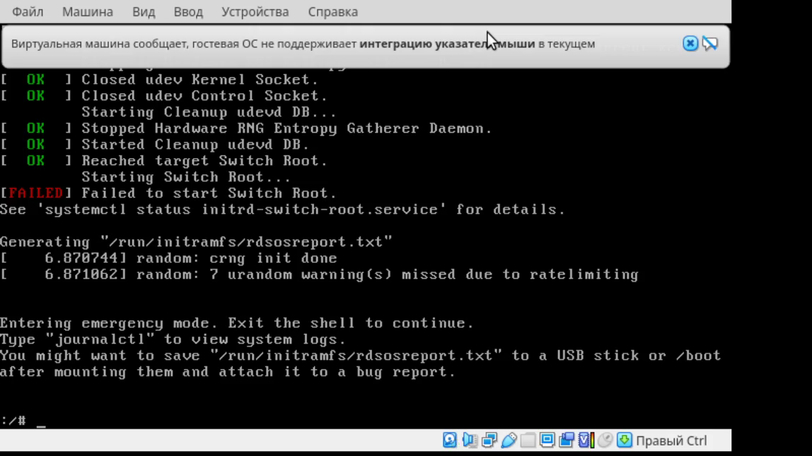
* выполняем комманды:
  * Делаем chroot: ```chroot /sysroot```
  * Меняем пароль root: ```passwd root```
  * запуск autorelabeling при загрузке: ```touch /.autorelabel```
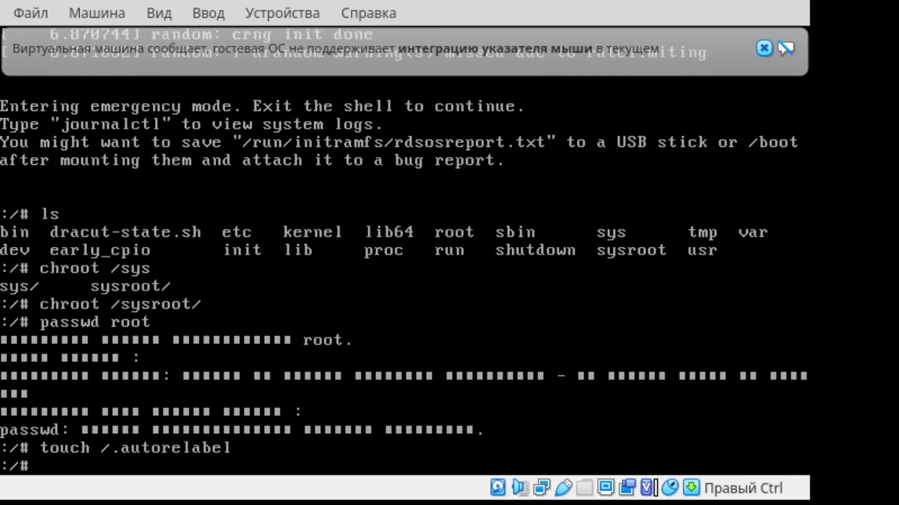
* Перезагружаемся, дожидаемся завершения autorelabeling
* входим под новым паролем root.

## 2. Установить систему с LVM, после чего переименовать VG

Используем Centos7 minimal

* Смотрим имя LVM группы

```bash
vgs
```

* Переименовываем группу

```bash
vgrename centos OtusRoot
```

* переименовываем группу в конфигах

```bash
sed -i 's/centos/OtusRoot/g' /etc/fstab
sed -i 's/centos/OtusRoot/g' /etc/default/grub
sed -i 's/centos/OtusRoot/g' /boot/grub2/grub.cfg
```

* Пересоздаем initramfs

```bash
mkinitrd -f -v /boot/initramfs-$(uname -r).img $(uname -r)
```

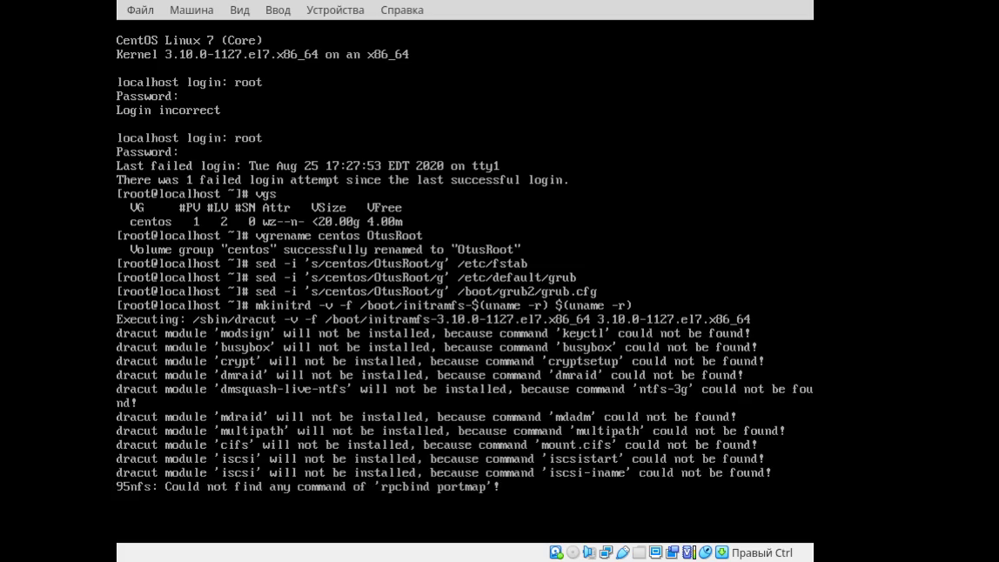

* Перезагружаемся и проверяем  
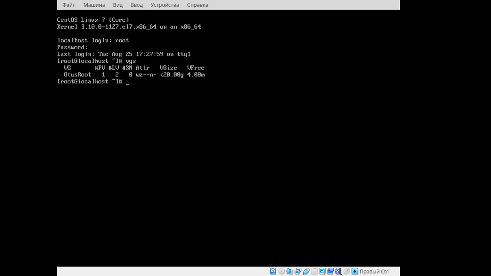

## 3. Добавить модуль в initrd

* Создаем папку

```bash
 mkdir /usr/lib/dracut/modules.d/01test
```

* Добавляем файлы модуей

```bash
cat << EOF > /usr/lib/dracut/modules.d/01test/module-setup.sh
#!/bin/bash

check() {
    return 0
}

depends() {
    return 0
}

install() {
    inst_hook cleanup 00 "${moddir}/test.sh"
}
EOF
```

```bash
cat << EOF > /usr/lib/dracut/modules.d/01test/test.sh
#!/bin/bash

exec 0<>/dev/console 1<>/dev/console 2<>/dev/console
cat <<'msgend'
Hello! You are in dracut module!
 ___________________
< I'm dracut module >
 -------------------
   \
    \
        .--.
       |o_o |
       |:_/ |
      //   \ \
     (|     | )
    /'\_   _/`\
    \___)=(___/
msgend
sleep 10
echo " continuing...."
EOF

```

* Даем права на исполнение

```bash
chmod +x /usr/lib/dracut/modules.d/01test/*.sh

```

* пересобираем initrd

```bash
mkinitrd -f -v /boot/initramfs-$(uname -r).img $(uname -r)
```

* Проверяем что модуль добавился

```bash
lsinitrd -m /boot/initramfs-$(uname -r).img | grep test
test
```

* Правим загрузчик

```bash
sed -i 's/quiet//g' /boot/grub2/grub.cfg
sed -i 's/rhgb//g' /boot/grub2/grub.cfg
```

* перезагружамся и проверяем  
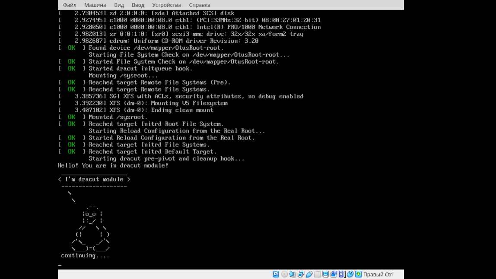
