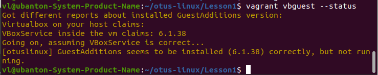
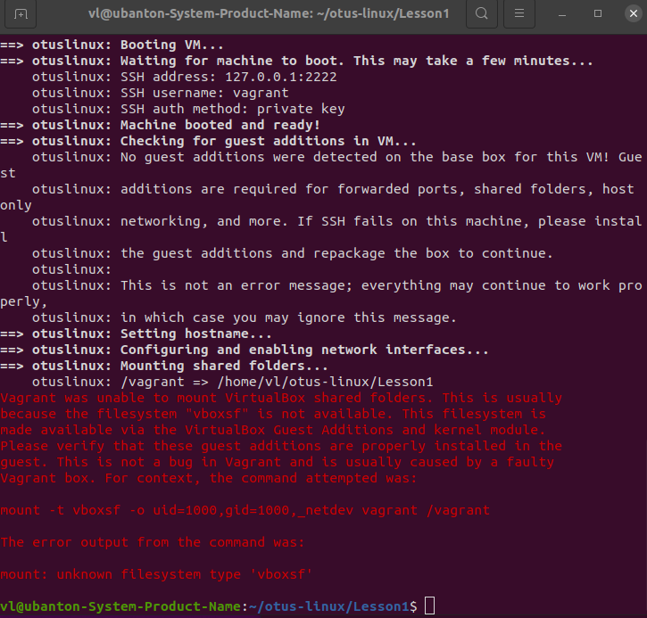
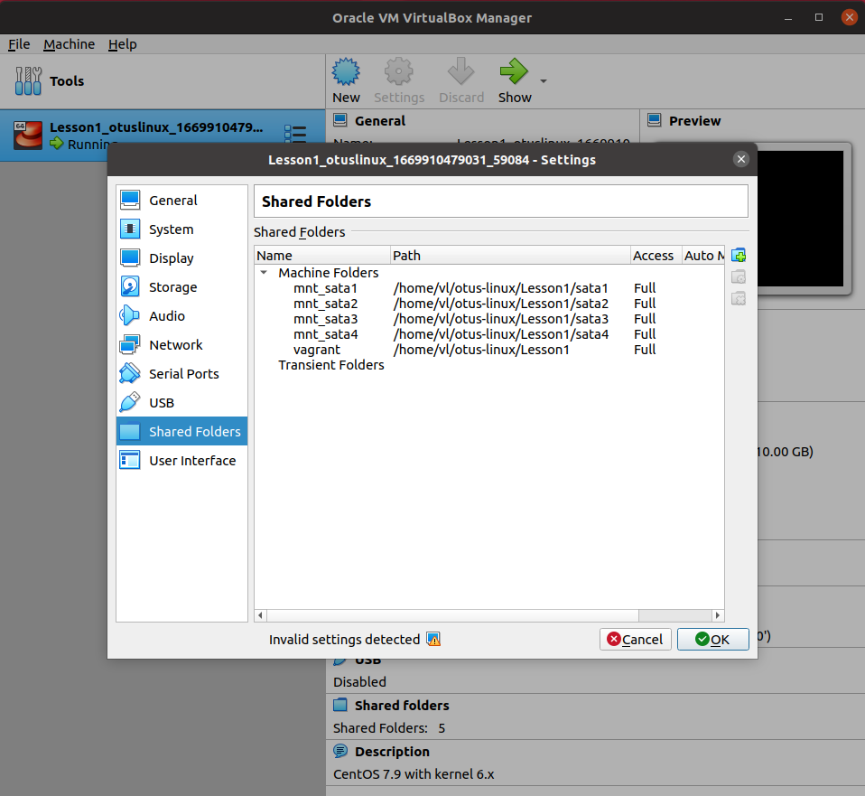

# Домашнее задание: "Обновить ядро в базовой системе"

## Описание/Пошаговая инструкция выполнения домашнего задания:

В материалах к занятию есть методичка, в которой описана процедура обновления ядра из репозитория.
По данной методичке требуется выполнить необходимые действия.
Полученный в ходе выполнения ДЗ Vagrantfile должен быть залит в ваш git-репозиторий.
Для проверки ДЗ необходимо прислать ссылку на него.
Для выполнения ДЗ со * и ** вам потребуется сборка ядра и модулей из исходников.
Методичка Настройка ПК для создания стендов и выполнения домашних заданий
https://docs.google.com/document/d/1fZUXL30bDhJEQpDQgtfv3Nj4WYWto98AaYlC1vJ2LkQ/edit?usp=sharing
Методичка Vagrant-стенд для обновления ядра и создания образа системы
https://docs.google.com/document/d/12sC884LuLGST3-tZYQBDPvn6AH8AGJCK/edit?usp=sharing&ouid=107126378526912727172&rtpof=true&sd=true

## Решение

### Создание образа системы
```
packer build centos.json
```

Результат успешного создания образа в Packer:
```
...
==> Wait completed after 28 minutes 23 seconds

==> Builds finished. The artifacts of successful builds are:
--> centos-7.9: 'virtualbox' provider box: centos-7.9.2009-kernel-6-x86_64-Minimal.box
```

### Импортирование полученного vagrant box в Vagrant:
```
vagrant box add centos7-kernel6 centos-7.9.2009-kernel-6-x86_64-Minimal.box
```
вывод:
```
=> box: Box file was not detected as metadata. Adding it directly...
==> box: Adding box 'centos7-kernel6' (v0) for provider: 
    box: Unpacking necessary files from: file:///home/vl/otus-linux/Lesson1/centos-7.9.2009-kernel-6-x86_64-Minimal.box
==> box: Successfully added box 'centos7-kernel6' (v0) for 'virtualbox'!
```

Запуск ВМ: ```vagrant up```

Подключимя к ней по SSH: ``` vagrant ssh ```

Проверка версии ядра: 
```
[vagrant@otuslinux ~]$ uname -r
6.0.11-1.el7.elrepo.x86_64
```

## ДЗ с **: в вашем образе нормально работают VirtualBox Shared Folders.

В Vagrantfile добавлено создание дисков, их форматирование, монтирование.
Добавлена синхронизация shared folders с созданными дисками.

Для нормальной работы shared folders требуется Добавление vbguest:
```
vagrant plugin install vagrant-vbguest
vagrant ssh -c "cat /var/log/vboxadd-install.log"
vagrant vbguest
```

Установка VirtualBox Addition завершилась с ошибкой:
```
[otuslinux] GuestAdditions seems to be installed (6.1.38) correctly, but not running.
...
Job for vboxadd.service failed because the control process exited with error code. See "systemctl status vboxadd.service" and "journalctl -xe" for details.
...
/opt/VBoxGuestAdditions-6.1.38/bin/VBoxClient: error while loading shared libraries: libX11.so.6: cannot open shared object file: No such file or directory
```

Попытка установить недостающие библиотеки ни к чему не привела:
```
yum update kernel kernel-headers
```

Проверка vbguest
```
vagrant vbguest --status
```



### Загрузка образа в Vagrant cloud
Логин в vagrant cloud: ``` vagrant cloud auth login ```

Публикование образа:
``` 
vagrant cloud publish --release <user_account>/centos8-kernel5 1.0 virtualbox centos-8-kernel-5-x86_64-Minimal.box
```

Вносим изменения в Vagrant файл, чтобы при запуске использовался образ из Vagrant Cloud
```
config.vm.box = "vlyulin/centos7-kernel6"
config.vm.box_version = "1.0"
```

### Проверка 

Проверяем настройки запуском виртуальной машины:
```
vagrant up
```

Из-за того, что некорректно поставлена VirtualBoxAddition, не монтируются Shared folders


Хотя shared folders показывает:



