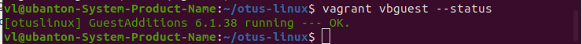
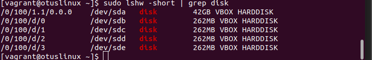
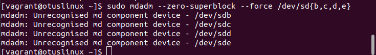
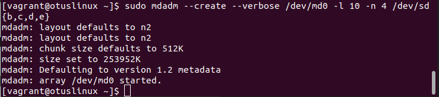
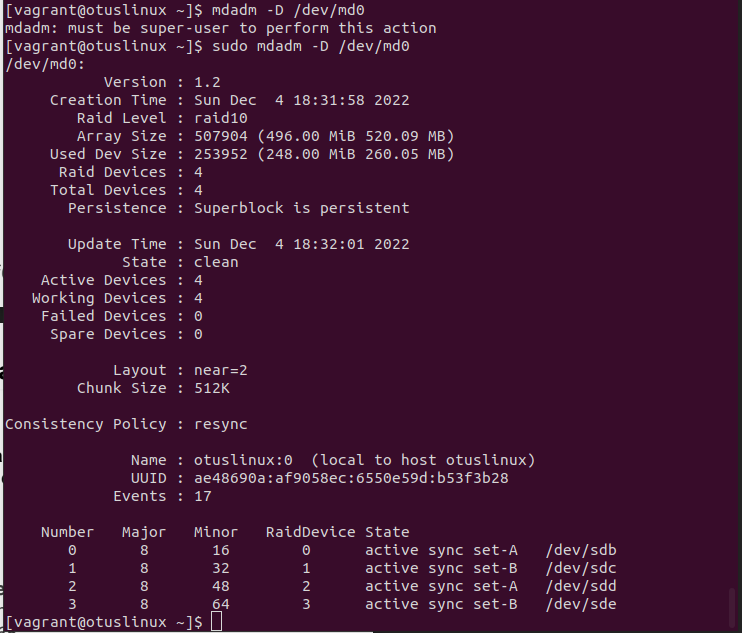
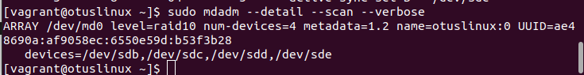
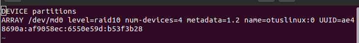

# Домашнее задание: ""Работа с mdadm

## Описание/Пошаговая инструкция выполнения домашнего задания:


- добавить в Vagrantfile еще дисков;
- сломать/починить raid;
- собрать R0/R5/R10 на выбор;
- прописать собранный рейд в конф, чтобы рейд собирался при загрузке;
- создать GPT раздел и 5 партиций.

В качестве проверки принимаются - измененный Vagrantfile, скрипт для создания рейда, конф для автосборки рейда при загрузке.

* доп. задание - Vagrantfile, который сразу собирает систему с подключенным рейдом и смонтированными разделами. После перезагрузки стенда разделы должны автоматически примонтироваться.
** перенести работающую систему с одним диском на RAID 1. Даунтайм на загрузку с нового диска предполагается. В качестве проверки принимается вывод команды lsblk до и после и описание хода решения (можно воспользоваться утилитой Script).
        
Методичка Работа с mdam https://drive.google.com/file/d/1phsvBYkiRPVrDG0EXagy-TF4P5y9XOAX/view?usp=share_link

## Решение

### Создание VM

Запуск VM: 
```vagrant up```

Установка vbguest
```
vagrant plugin install vagrant-vbguest
vagrant vbguest
```
Получена ошибка:
```
No package kernel-devel-3.10.0-1127.el7.x86_64 available.
```

Решение найдено на ресурсе: https://www.lntn203.com/dokuwiki/doku.php/devops-sysadmin/vagrant/vagrant-umount-mnt-not-mounted

В Vargantfile параметр allow_kernel_upgrade установлен в значение true.
```
config.vbguest.installer_options = { allow_kernel_upgrade: true }
```

Проверка установки vbguest:
```
vagrant vbguest --status
```




### Собрать RAID 10
Обнуление суперблоков:	
```
sudo lshw -short | grep disk
```



```
sudo mdadm --zero-superblock --force /dev/sd{b,c,d,e}			
```

	
#### Создание RAID 10 на 4 устройствах:
```
sudo mdadm --create --verbose /dev/md0 -l 10 -n 4 /dev/sd{b,c,d,e}
```



Проверка, что RAID собрался нормально:	
```
cat /proc/mdstat
```


```	
sudo mdadm -D /dev/md0	
```


	
Проверка перед созданием mdadm.conf:
```
sudo mdadm --detail --scan --verbose
```


	
### Создание конфигурационного файла mdadm.conf
```
sudo mkdir -p /etc/mdadm
sudo touch /etc/mdadm/mdadm.conf
sudo chmod 666 /etc/mdadm/mdadm.conf
sudo echo "DEVICE partitions" > /etc/mdadm/mdadm.conf
sudo mdadm --detail --scan --verbose | awk '/ARRAY/{print}' >> /etc/mdadm/mdadm.conf
```




