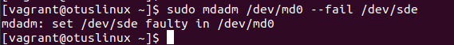
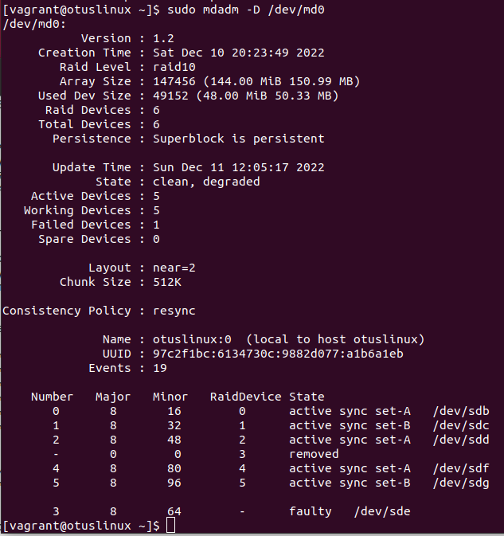
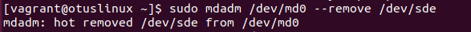
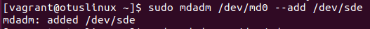
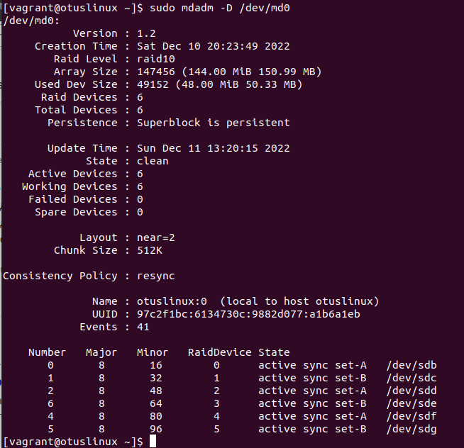
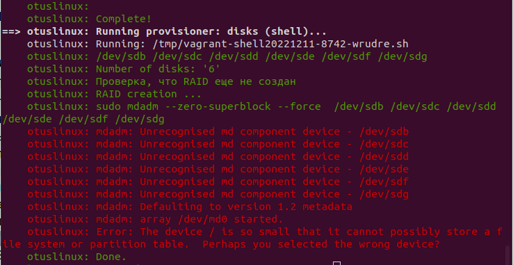

# Домашнее задание: ""Работа с mdadm

## Описание/Пошаговая инструкция выполнения домашнего задания:

- добавить в Vagrantfile еще дисков;
- сломать/починить raid;
- собрать R0/R5/R10 на выбор;
- прописать собранный рейд в конф, чтобы рейд собирался при загрузке;
- создать GPT раздел и 5 партиций.

В качестве проверки принимаются - измененный Vagrantfile, скрипт для создания рейда, конф для автосборки рейда при загрузке.

* доп. задание - Vagrantfile, который сразу собирает систему с подключенным рейдом и смонтированными разделами. После перезагрузки стенда разделы должны автоматически примонтироваться.

** перенести работающую систему с одним диском на RAID 1. Даунтайм на загрузку с нового диска предполагается. В качестве проверки принимается вывод команды lsblk до и после и описание хода решения (можно воспользоваться утилитой Script).
        
Методичка Работа с mdam https://drive.google.com/file/d/1phsvBYkiRPVrDG0EXagy-TF4P5y9XOAX/view?usp=share_link

## Запуск

```
vagrant up
```

## Решение

### Задача: "добавить в Vagrantfile еще дисков"

В файл Vagrantfile добавлен текст:
```
MACHINES = {
  :otuslinux => {
        :box_name => "centos/7",
        :ip_addr => '192.168.56.101',
        :disks => {
...
		:sata5 => {
                        :dfile => './sata5.vdi',
                        :size => 50, # Megabytes
                        :port => 5
                },
                :sata6 => {
                        :dfile => './sata6.vdi',
                        :size => 50, # Megabytes
                        :port => 6
                }
...
```

### Задача: "сломать/починить raid"

Искуственное выведение устройства из работы:
```
sudo mdadm /edv/md0 --fail /dev/sde
```


Измененная информация о RAID:
```
cat /proc/mdstat
```
![mdstat-for-broken-disk]mdstat-for-broken-disk.png

```
sudo mdadm -D /dev/md0
```


Удаление сломанного диска из массива:
```
sudo mdadm /dev/md0 --remove /dev/sde
```


Добавление в RAID нового добавленного диска после замены:
```
sudo mdadm /dev/md0 --add /dev/sde
```



### Задача: "собрать R0/R5/R10 на выбор"

Создание RAID 10 выполняется с помощью следующих команд в файле script.sh
```
...
           # Обнуление суперблоков:
           echo "sudo mdadm --zero-superblock --force " $DISKS
           sudo mdadm --zero-superblock --force $DISKS
           # Создание RAID 10 на $DISKS_NUMBER устройствах:
           sudo mdadm --create --verbose /dev/md0 -l 10 -n $DISKS_NUMBER -q -f $DISKS <<< y
           if [ $? -gt 0 ]; then
                # Если RAID создан
                # Создание конфигурационного файла mdadm.conf, если он не существует.
                FILE=/etc/mdadm/mdadm.conf
                if [ ! -f "$FILE" ]; then
                        sudo mkdir -p /etc/mdadm
                        sudo touch /etc/mdadm/mdadm.conf
                        sudo chmod 666 /etc/mdadm/mdadm.conf
                        sudo echo "DEVICE partitions" > /etc/mdadm/mdadm.conf
                        sudo mdadm --detail --scan --verbose | awk '/ARRAY/{print}' >> /etc/mdadm/mdadm.conf
                fi
...
```

Скрипт script.sh вызывается как provision из Vagrantfile:
```
box.vm.provision "disks", type: "shell", path: "script.sh"
```

Данный provision можно вызвать повторно с помощью команды:
```
vagrant provision --provision-with "disks"
```

### Задача: "прописать собранный рейд в конф, чтобы рейд собирался при загрузке;"

Конфигурационный файл для RAID формируется в скрипте script.sh в строках:
```
                # Создание конфигурационного файла mdadm.conf, если он не существует.
                FILE=/etc/mdadm/mdadm.conf
                if [ ! -f "$FILE" ]; then
                        sudo mkdir -p /etc/mdadm
                        sudo touch /etc/mdadm/mdadm.conf
                        sudo chmod 666 /etc/mdadm/mdadm.conf
                        sudo echo "DEVICE partitions" > /etc/mdadm/mdadm.conf
                        sudo mdadm --detail --scan --verbose | awk '/ARRAY/{print}' >> /etc/mdadm/mdadm.conf
                fi

```



### Задача: "создать GPT раздел и 5 партиций."

Создание GPT раздела выполняется следующими командами в скрипте script.sh:
```
                # Создание раздела GPT на RAID
                sudo parted -s /dev/md0 mklabel gpt
                # Создание партиций
                sudo parted -s -a optimal /dev/md0 mkpart primary ext4 0% 20%
                sudo parted -s -a optimal /dev/md0 mkpart primary ext4 20% 40%
                sudo parted -s -a optimal /dev/md0 mkpart primary ext4 40% 60%
                sudo parted -s -a optimal /dev/md0 mkpart primary ext4 60% 80%
                sudo parted -s -a optimal /dev/md0 mkpart primary ext4 80% 100%
                # Создание файловых систем
                for i in $(seq 1 5); do sudo mkfs.ext4 /dev/md0p$i; done
                # Монтирование партиций по каталогам
                sudo mkdir -p /raid/part{1,2,3,4,5}
                for i in $(seq 1 5); do
                        sudo mount /dev/md0p$i /raid/part$i;
                        # Формирование записей в fstab
                        echo "check md0p$i in fstab"
                        if sudo grep -Fxq "md0p$i" /etc/fstab
                        then
                           echo "md0p$i exists in fstab"
                        else
                           echo `blkid /dev/md0p$i | awk '{print$2}' | sed -e 's/"//g'` /raid/part$i   xfs   defaults,noatime   0   0 | tee -a /etc/fstab > /dev/null
                        fi
                done

```

### доп. задание - Vagrantfile, который сразу собирает систему с подключенным рейдом и смонтированными разделами. После перезагрузки стенда разделы должны автоматически примонтироваться.

Сбор системы с созданием RAID, его подключением и смонтированными разделами выполняется через скрипт script.sh, который вызывается из файла Vagrantfile:
```
box.vm.provision "disks", type: "shell", path: "script.sh"
```




