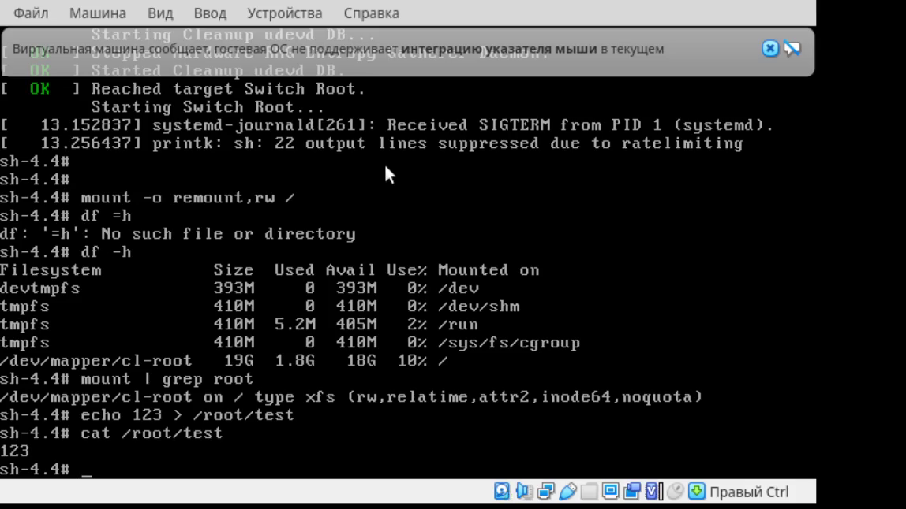
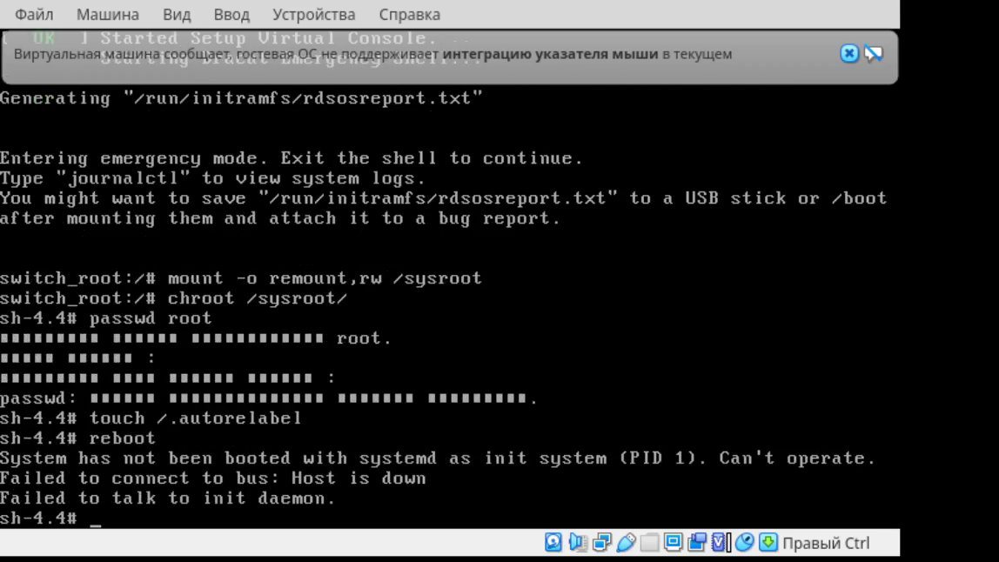
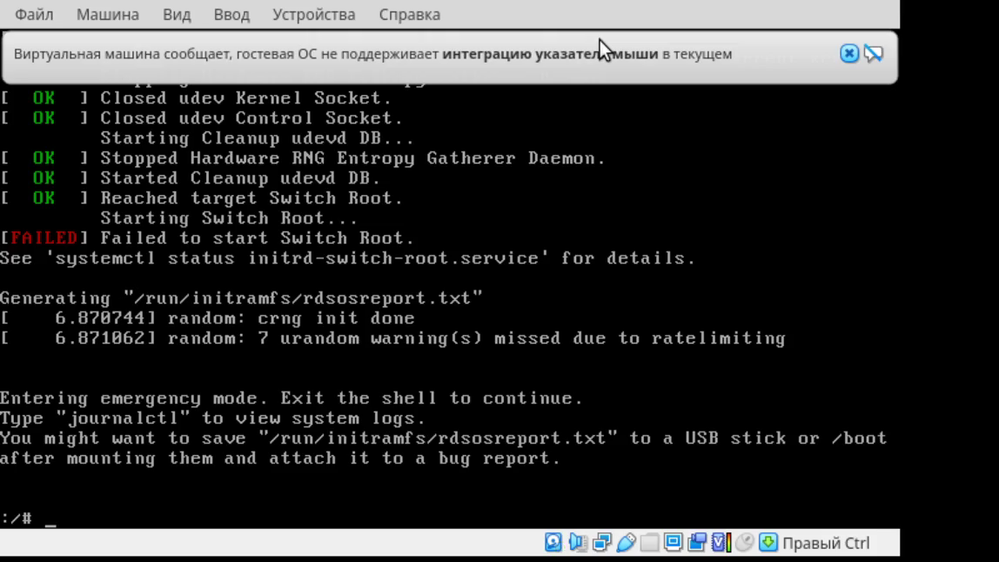

# Загрузка системы

## Домашнее задание

1. Попасть в систему без пароля несколькими способами
2. Установить систему с LVM, после чего переименовать VG
3. Добавить модуль в initrd

___Операции происходят на установке Centos8 minimal___

### 1. Попасть в систему без пароля несколькими способами


#### Способ 1. init=/bin/sh

* При загрузке в Grub, выбираем нужное ядро, нажимаем **e**
* в конце строки начинающейся на linux вбиваем ```init=/bin/sh``` и нажимаем **ctr+x** для загрузки

* после загрузки сразу получаем shell

* Перемонтируем ФС в RW режим и пробуем что то записать на диск

    ```bash
    mount -o remount,rw /
    mount | grep root
    ```

    

#### Способ 2. rd.break

* При загрузке в Grub, выбираем нужное ядро, нажимаем **e**
* в конце строки начинающейся на linux вбиваем ```rd.break``` и нажимаем **ctr+x** для загрузки

* Получаем shell

* выполняем комманды:
  * монтируем в RW режим ситсему: ```mount -o remount,rw /sysroot```
  * Делаем chroot: ```chroot /sysroot```
  * Меняем пароль root: ```passwd root```
  * запуск autorelabeling при загрузке: ```touch /.autorelabel```

* Перезагружаемся, дожидаемся завершения autorelabeling

* входим под новым паролем root.

#### Способ 3. rw init=/sysroot/bin/sh

* При загрузке в Grub, выбираем нужное ядро, нажимаем **e**
* в конце строки начинающейся на linux вбиваем вместо ```ro``` ``` rw init=/sysroot/bin/sh``` и нажимаем **ctr+x** для загрузки

* После загрузки получаем shell

* выполняем комманды:
  * Делаем chroot: ```chroot /sysroot```
  * Меняем пароль root: ```passwd root```
  * запуск autorelabeling при загрузке: ```touch /.autorelabel```

* Перезагружаемся, дожидаемся завершения autorelabeling
* входим под новым паролем root.

## 2. Установить систему с LVM, после чего переименовать VG

## 3. Добавить модуль в initrd
