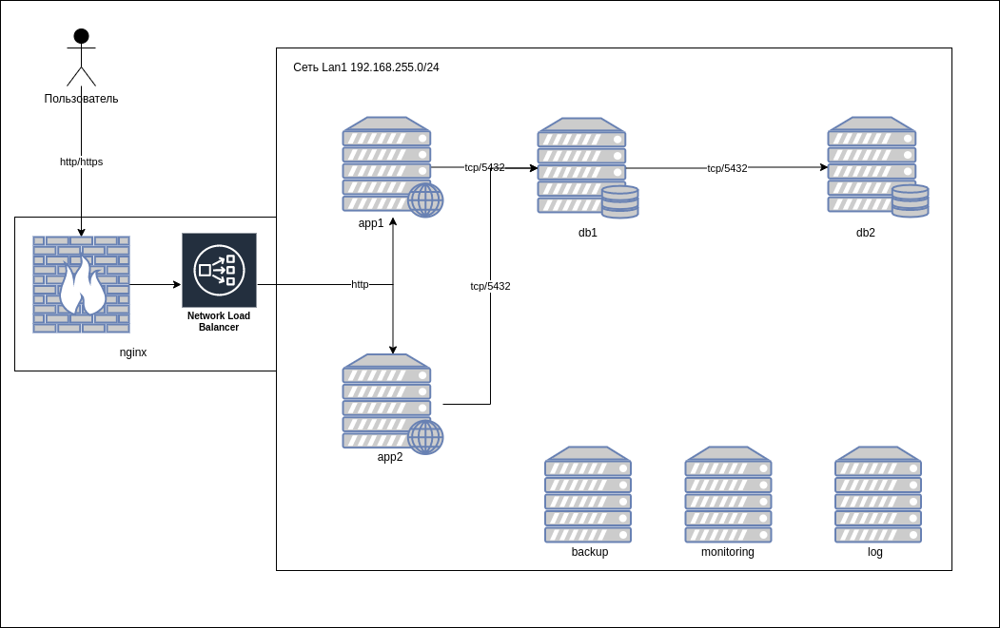

# Проект

## ТЗ

```txt
Проект
Цель: Создание рабочего проекта
веб проект с развертыванием нескольких виртуальных машин
должен отвечать следующим требованиям
* включен https
* основная инфраструктура в DMZ зоне
* файрвалл на входе
* сбор метрик и настроенный алертинг
* везде включен selinux
* организован централизованный сбор логов
```

## Запуск проекта

```bash
cd project
python3 -m venv venv
source venv/bin/activate
pip3 install -r requirements.txt
make install
```

* Стенд разворачивается около 25 минут
* vault pass ```otus2021```

## Описание



### Веб приложение

* https от Let's Encript
* Приложение [healthchecks](https://github.com/healthchecks/healthchecks)
  * Прииложение на Paython + Django
  * Работает как система мониторинга CronJobs. Для работы нужно получить ссылку в сервисе и к крон задаче добавить с помошью `&&` вызов ссылки через курл. Таким образов Приложение проверяет что крон задача выполнилась вовремя и оповещает(email, telegram, slack, etc.) о том что задача не выполнилась в каких то рамках времени.
* Приложение доступно по ссылке( резолвится в локальный адрес виртуалки nginx)
  * [http://hc.otus.iudanet.com]

### База данных

* Используется Postgres 11
* при падении мастера
  * Промоутим реплику в мастер

  ```bash
  sudo -u postgres /usr/pgsql-11/bin/pg_ctl promote  -D /var/lib/pgsql/11/data/
  ```

  * Заливаем Ansible Новые настрйоки базы для приложения
  
  ```bash
  make limit L="app1,app2 --tag django -e django_db_host=db2"
  ```

### Мониторинг

* Развернут стек prometheus * alertmanager * grafana
* домены
  * [http://grafana.otus.iudanet.com]
  * [http://prom.otus.iudanet.com]
  * [http://alerts.otus.iudanet.com]
* Пароль от grafana ```otus:Otus2021```
* На хостах установлен  node_exporter  для сбора метрик
* в grafana добавлен дашборд для отображения метрик node_exporter
* Алерты о проблемах шлются из alertmanager в канал slack

### Фаервол

* на всех хостах включен firewalld
* хост nginx имеет 2 интерфейса
  * зона `dmz` для подключений внешних пользоваталей
    * 80/tcp nginx http
    * 443/tcp nginx https
  * зона `work` для локальной доверенной сети
* Остальные хосты имеют 1 интерфейс с зоной `work`
* на всех хостах в зоне `work` разрешено
  * 9100/tcp node_exporter
  * 22/tcp sshd
* хосты app1 и app2
  * 8000/tcp django
* Хосты db1 и db2
  * 5432/tcp postgres
* хост log
  * 514/tcp rsyslog
  * 514/udp rsyslog
* хост monitoring
  * 9090/tcp prometheus web
  * 3000/tcp grafana web
  * 9093/tcp alertmanager web

### резервное копирование

* для бекапов файлов используется ```borgbackup```
  * сохраняются катологи
    * "/etc"
    * "/root"
    * "/home"
    * "/opt"
* для бекапов postgres используется ```barman``` в режиме стриминга
* Бекапы файлов создаются с меткой времени

    ```bash
    [root@client ~]# borg-backup list
    Archives on server :
    Using a pure-python msgpack! This will result in lower performance.
    Remote: Using a pure-python msgpack! This will result in lower performance.
    20201118-0837                        Wed, 2020-11-18 08:37:07 [086a2c98fdf75a8e75b008ba98783da1e9dae3c7d19df69cc6e476e7bda3f1c8]
    20201118-0840                        Wed, 2020-11-18 08:40:05 [7adebece4539add65004879f3f04be73ab99f9a729fc0e71cc6bbbadbe457d3a]
    20201118-0845                        Wed, 2020-11-18 08:45:03 
    [0b1081aeae37a119bf775f24037b9bef6e1f992267ebb1978a1e1011135c812c]
    20201118-0850                        Wed, 2020-11-18 08:50:04 [80e667b78a65a67f3bf5710227a206adb4ef18d7c633c1761083eaedaf817041]
    ```

* используется скрипт для резервного копирования

    ```bash
    [root@client ~]# cat /etc/cron.d/borg-backup 
    #Ansible: borg-backup
    30 * * * * root /usr/local/bin/borg-backup backup
    ```

* процесс восстановления файлов

```bash
# смотрим листинг бекапов
[root@client ~]# borg-backup list
Archives on server :
Using a pure-python msgpack! This will result in lower performance.
Remote: Using a pure-python msgpack! This will result in lower performance.
20201118-0837                        Wed, 2020-11-18 08:37:07 [086a2c98fdf75a8e75b008ba98783da1e9dae3c7d19df69cc6e476e7bda3f1c8]
20201118-0840                        Wed, 2020-11-18 08:40:05 [7adebece4539add65004879f3f04be73ab99f9a729fc0e71cc6bbbadbe457d3a]
20201118-0845                        Wed, 2020-11-18 08:45:03 [0b1081aeae37a119bf775f24037b9bef6e1f992267ebb1978a1e1011135c812c]
20201118-0850                        Wed, 2020-11-18 08:50:04 [80e667b78a65a67f3bf5710227a206adb4ef18d7c633c1761083eaedaf817041]
20201118-0855                        Wed, 2020-11-18 08:55:03 [30a2f6c4faf5aeab4f186b09dd6f688e0859db9095a0fbada931563a04d43f11]

# монтируем конкретный бекап по имени
[root@client ~]# borg-backup mount 20201118-0855 server /mnt/

[root@client ~]# ls -lah /mnt
total 0
drwxr-xr-x.  1 root root   0 Nov 18 08:58 .
dr-xr-xr-x. 17 root root 240 Apr 30  2020 ..
drwxr-xr-x.  1 root root   0 Nov 18 08:19 etc
drwxr-xr-x.  1 root root   0 Apr 30  2020 home
drwxr-xr-x.  1 root root   0 Apr 11  2018 opt
dr-xr-x---.  1 root root   0 Nov 18 08:38 root

# Удаляем данные из /etc
[root@client ~]# rm -rf /etc/*
[root@client ~]# ls -lah /etc
total 4.0K
drwxr-xr-x.  2 0 0  39 Nov 18 09:06 .
dr-xr-xr-x. 17 0 0 240 Apr 30  2020 ..
-rw-------.  1 0 0   0 Apr 30  2020 .pwd.lock
-rw-r--r--.  1 0 0 163 Apr 30  2020 .updated

# восстанавливаем из резерва
[root@client ~]# rsync -a /mnt/etc/ /etc
[root@client ~]# ls -lah /etc
total 1.1M
drwxr-xr-x. 78 root root   8.0K Nov 18 08:19 .
dr-xr-xr-x. 17 root root    240 Apr 30  2020 ..
-rw-r--r--.  1 root root     16 Apr 30  2020 adjtime
-rw-r--r--.  1 root root   1.5K Apr  1  2020 aliases
-rw-r--r--.  1 root root    12K Nov 18 08:18 aliases.db
drwxr-xr-x.  2 root root   4.0K Apr 30  2020 alternatives
-rw-------.  1 root root    541 Aug  8  2019 anacrontab
drwxr-x---.  3 root root     43 Apr 30  2020 audisp
...
```

* процесс восстановления базы данных

```txt
bash-4.2$ barman recover streaming latest /tmp/data
Starting local restore for server streaming using backup 20210127T193336
Destination directory: /tmp/data
Copying the base backup.
Copying required WAL segments.
Generating archive status files
Identify dangerous settings in destination directory.

Recovery completed (start time: 2021-01-27 19:37:43.631364, elapsed time: 1 second)

Your PostgreSQL server has been successfully prepared for recovery!

rsync -a /tmp/data db1:

# подключиться к db1
sudo systemctl stop postgres-11
rm -rf /var/lib/pgsql/11/data
mv data /var/lib/pgsql/11/data
chown -R postgres:postgres /var/lib/pgsql/11/data
sudo systemctl start postgres-11
```

### Логирование

* Используется rsyslog
* Все логи с хостов из syslog и journald передаются через rsyslog на сервер `log`
* сервер `log` принимает логи и раскладывает их по шаблону ```/var/log/rsyslog/%FROMHOST-IP%/%$year%-%$month%-%$day%/%PROGRAMNAME%.log```
* Postgres пишет логи в локальный syslog
* nginx пишет логи локально и в удаленный syslog server
* django пишет логи в `journald` с тегом `django`
